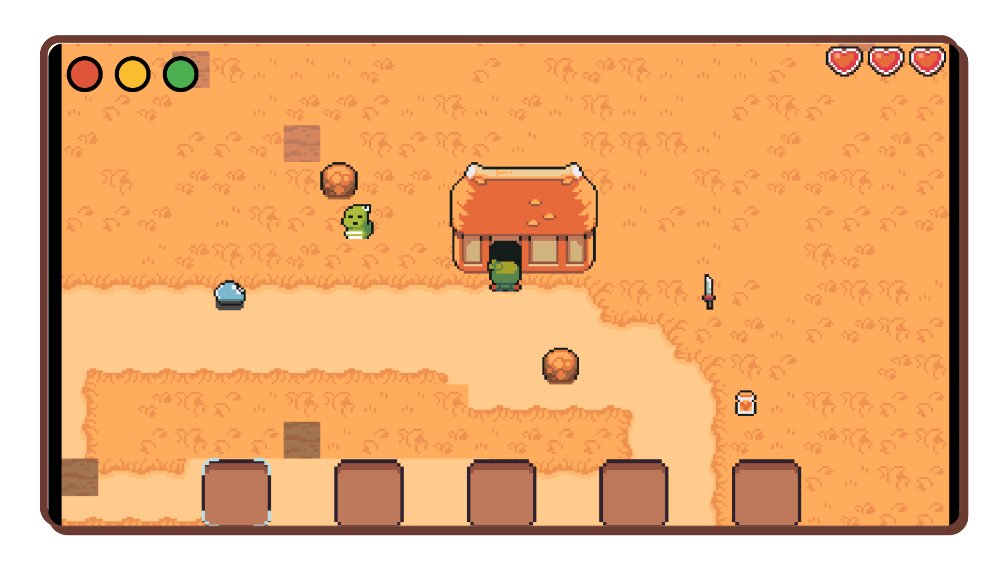
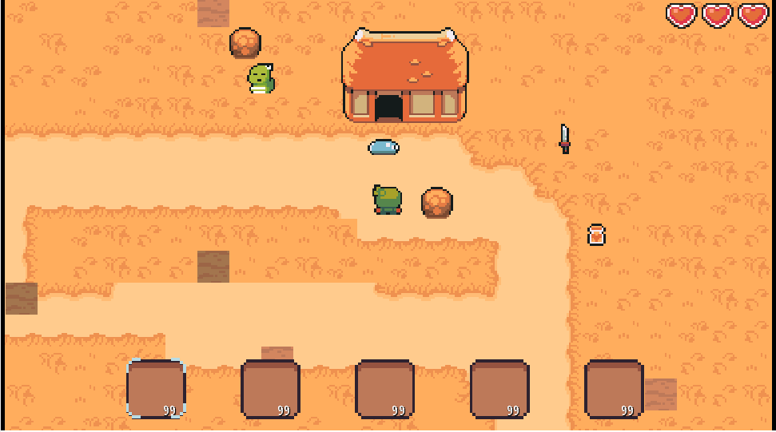
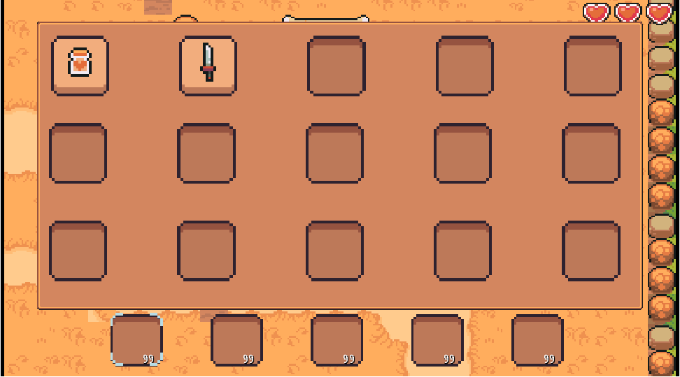

# 💼 Jogo RPG
> Um RPG completo com combate corpo-a-corpo, exploração, troca de cenas e gerenciamento de inventário, desenvolvido inteiramente em Godot usando GDScript.

---

## 🚀 Demonstração
🔗 **Acesse o projeto:** [link-do-deploy-aqui](http://jedev1.itch.io/rpg-game)  

📸 **Preview:**  


---

## 📚 Sumário
- [Sobre o Projeto](#-sobre-o-projeto)
- [Tecnologias](#️-tecnologias)
- [Funcionalidades](#-funcionalidades)
- [Como Rodar o Projeto](#-como-rodar-o-projeto)
- [Como Usar](#-como-usar)
- [Screenshots](#️-screenshots)
- [Aprendizados](#-aprendizados)
- [Estrutura de Pastas](#-estrutura-de-pastas)
- [Roadmap](#-roadmap)
- [Links Úteis](#-links-úteis)
- [Autor](#-autor)
- [Licença](#-licença)

---

## 💡 Sobre o Projeto
Este Jogo foi desenvolvido **para Testar minhas habilidades, e criar algo divertido e jogavél**.  
O jogo foi construído com **Godot e GDscript**, com foco em **Jogabilidade, performance e features clássicas de um jogo RPG**.

---

## 🛠️ Tecnologias
As principais tecnologias utilizadas neste projeto foram:

- **Godot** (motor de jogos)
- **GDscript** (Linguagem de programação nativa da godot)

<div align="right">
  
</div>

---

## 📚 Funcionalidades
- [x] ⚔️ Combate corpo-a-corpo (melee) → Derrote inimigos usando ataques físicos
- [x] 🌍 Exploração com troca de cena → Movimente-se entre diferentes áreas do jogo
- [x] 🛡 Sistema de inventário → Pegue, equipe e gerencie itens durante a aventura
- [x] 👾 IA de inimigos → Inimigos com comportamento básico e estratégias de ataque
- [x] 🐞 Tratamento de eventos e colisões → Gameplay divertido

---

## 📦 Como Rodar o Projeto
Siga as etapas abaixo para executar o projeto localmente:

```bash
# Clone este repositório
git clone https://github.com/joao-enrique/RPG-game.git
```
E abra o projeto na godot
> 💡 Caso não tenha o Godot engine instalado, procure no google e siga os passos para sua instalação.

---

## 🧪 Como Usar
1. Instale a `godot`.
2. Entre na `godot`.
3. Execute a cena principal (Main.tscn) clicando em Play Scene ou Play Project.
4. Jogue o jogo.
> 💡 O jogo roda nativamente na Godot, sem necessidade de instalação adicional.

---

## 🖼️ Screenshots
### 💻 tela inicial

### 💻 tela de inventário


---

## 🧠 Aprendizados
Durante o desenvolvimento deste projeto, aprimorei:
- Meus conhecimentos no `Godot`;
- Criação de um jogo RPG;
- Criação de UI na gameplay;
- Aprimoração na linguagem `GDscript` para criação de jogos.

---

## 📁 Estrutura de Pastas
RPG-game/ </br>
├── Assets/ </br>
├── Collectables/ </br>
├── Components/ </br>
├── Enemies/ </br>
├── Fonts/ </br>
├── GUI/ </br>
├── Images/ </br>
├── inventoryItems/ </br>
├── Player/ </br>
├── Scenes/ </br>
├── scripts/ </br>
└── README.md </br>
---

## 🚧 Roadmap
- [] Aumentar mapas
- [] Novos inimigos
- [] Menu inicial
- [] Melhorar IA dos inimigos (seguir o jogador de forma mais inteligente, atacar em grupo)
- [] Adicionar sistema de nível (XP) e atributos de personagem (força, defesa, agilidade)
- [] Implementar sistema de loot ao derrotar inimigos
- [] Criar janela de status do jogador (HP, MP, XP, nível, equipamento atual)
- [] Melhorar transições entre áreas (fade, portais, portas com animação)
- [] Adicionar trilhas sonoras diferentes por região
- [] Inserir efeitos sonoros (passos, golpes, coletar itens, abrir baús)
- [] Inserir NPCs com diálogos simples e sistema de missões

---

## 🔗 Links Úteis
🌐 Deploy: [link](https://meu-portfolio-lemon-sigma.vercel.app/)  </br>
💼 LinkedIn: [link](https://www.linkedin.com/in/joao-enrique-dev/) </br>
🧠 GitHub: [link](https://github.com/joao-enrique) </br>
🎮 Itch-io: [link](https://jedev1.itch.io/) </br>
📹 YouTube: [link](https://www.youtube.com/@joaocodedev) </br>
✨ Linktree: [link](https://linktree-eight-gules.vercel.app/) </br>

## 👨‍💻 Autor
Feito com 💜 por [João Enrique](https://linktree-eight-gules.vercel.app/)
<div align="right">
  <a href="https://www.linkedin.com/in/joao-enrique-dev/" target="_blank">
    
  </a>
  <a href="https://www.youtube.com/@joaocodedev" target="_blank">
    
  </a>
  <a href="https://jedev1.itch.io/" target="_blank">
    
  </a>
</div>

---

## 📜 Licença
Este projeto está sob a licença **MIT** — veja o arquivo [LICENCE](./LICENSE) para mais detalhes.


### ⭐ Se este projeto te inspirou, não esqueça de deixar uma **estrela** no repositório!